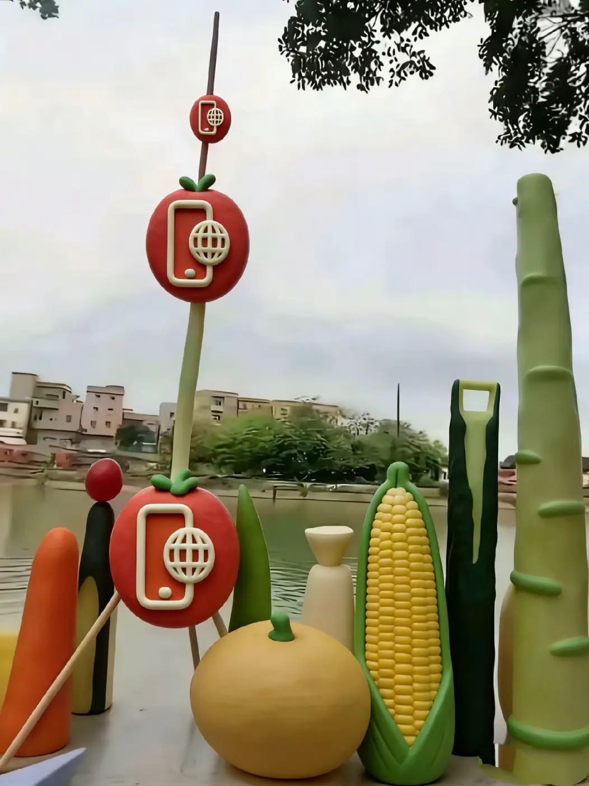
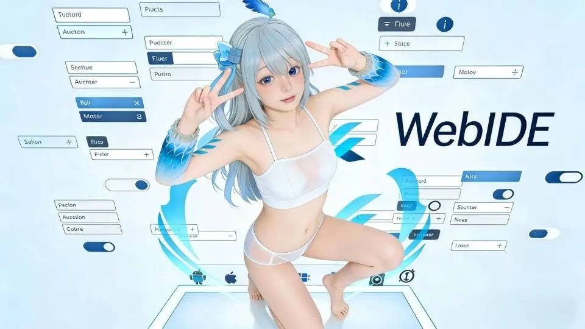

# 短篇

## 1. 拜年词

1. 快过年了，你不用再躲在角落偷偷修改手机系统了。你带着用WebIDE做的漂亮应用回家，亲戚朋友都会羡慕。他们掏出iPhone刷抖音，你打开自己做的APP，流畅又好玩。饭桌上被问起今年收获，你说用WebIDE开发了一个能赚钱的工具，亲戚们都夸你有本事。你爸妈也不用再担心你对着电脑瞎忙活，反而会为你骄傲。这就是用WebIDE的好处——让你在新年里既体面又有成就感。

## 2. 改变世界

<video width="640" height="360" controls>
  <source src="media/e.mp4" type="video/mp4">
</video>

改变世界只差一个WebIDE开发工具。

1. 基于 ace.js 深度优化，内置强大的 Termux 环境

2. 支持创建 Java 项目，支持 PHP 运行和打包

3. 支持 HTML 悬浮窗，可执行 sh 命令

4. 支持 JS、PHP、Java 多语言无缝兼容

5. 创新的 HTML 可视化编辑功能，让界面设计更简单

6. 提供超多私有接口，让你的 App 功能更强大

7. 全自动加密 HTML、JS、CSS、Java 代码，有效保护 App 安全

8. 让开发 WebApp 变得更轻松

神秘代码:937403182

## 3. WebIDE的征途

WebIDE为每一位深耕手机编程的开发者，打造一个永恒的技术港湾，让移动开发的火种生生不息。

## 4. WebIDE工具定制挂件小W

WebIDE工具定制挂件小W和品牌LOGO即将推出，优秀webide开发者可免费获得此挂件[笑]

## 5. WebIDE工具定制小w宝贝鉴赏

WebIDE开发工具全新定制小w形象宝贝鉴赏，活泼可爱的形象萌力拉满！圆乎乎的脸蛋缀着灵动大眼，软萌发型搭配充满科技感的工装短衫，举手投足都透着元气俏皮。

<video width="640" height="360" controls>
  <source src="media/w.mp4" type="video/mp4">
</video>

它是代码世界的贴心伙伴，陪你敲下每一行指令，用治愈萌态消解开发疲惫；更是WebIDE的专属代言人，将硬核开发与软萌可爱完美碰撞，一眼就爱上，谁能拒绝这样的开发搭子！
